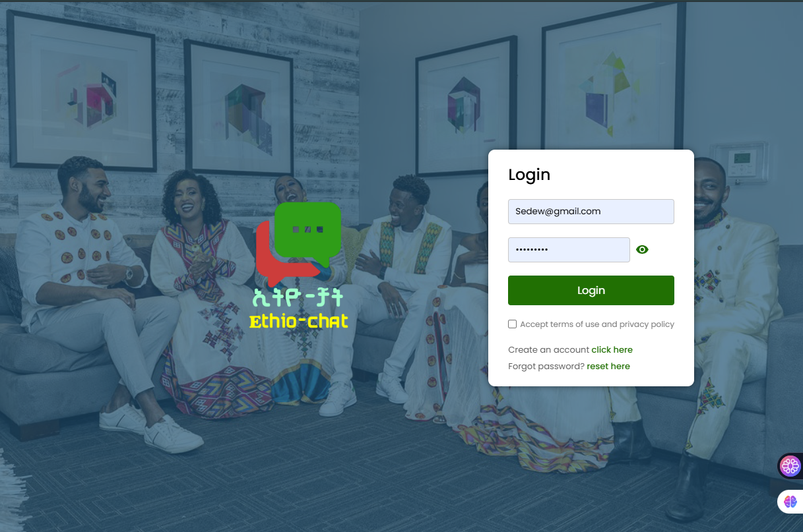
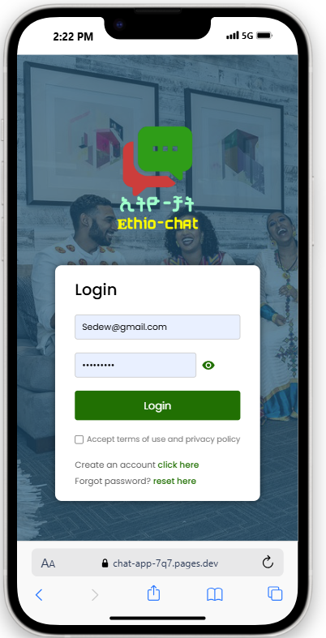
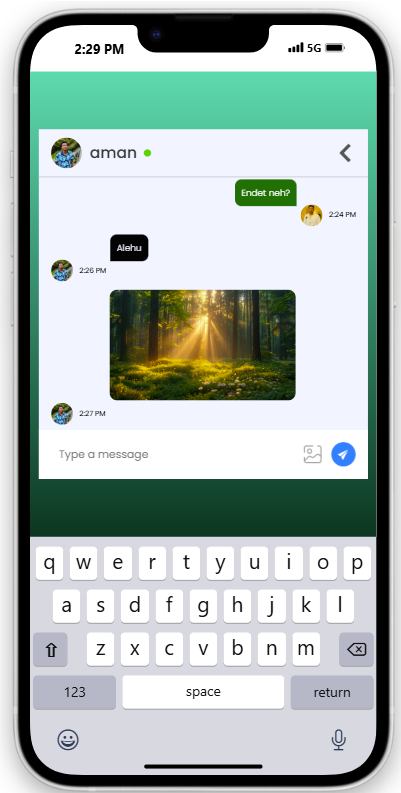

# Ethio Chat App

<p align="center">
  
</p>

## 📗 Table of Contents

- [About the Project](#about-project)
- [🛠 Built With](#built-with)
- [Key Features](#key-features)
- [Screenshot Preview](#screenshot-preview)
- [🚀 Live Demo](#live-demo)
- [🧾Getting Started](#getting-started)
  - [Prerequisites](#prerequisites)
  - [💻 Setup](#setup)
  - [Install Dependencies](#install-dependencies)
  - [Usage](#usage)
  - [Run Tests](#run-tests)
  - [Deployment](#deployment)
- [🔭Future Features](#future-features)
- [⭐️Show Your Support](#show-your-support)
- [🙏Acknowledgments](#acknowledgments)
- [📝 License](#license)

---

## ❔ About the Project <a name="about-project"></a>

This is a full-stack chat application built with React and Firebase. Users can create accounts, sign in, and enjoy real-time chat with friends. The app stores messages in Firestore and allows image sharing via Firebase Storage. The goal is to provide a seamless real-time messaging experience.

---

## 🛠 Built With <a name="built-with"></a>

- React (Front-end)
- Firebase Authentication
- Firestore Database
- Firebase Storage for image uploads

---

## Key Features <a name="key-features"></a>

- Real-time chatting functionality using Firestore.
- Image sharing with Firebase Storage.
- Firebase authentication (sign up, login, logout).
- Mobile-responsive interface.

---

## Screenshot Preview <a name="screenshot-preview"></a>

<p align="center">
  
  <div style="display: flex; justify-content: space-between;">
  
  
</div>
</p>

---

## Live Demo <a name="live-demo"></a>

To see this project's live demo, please click [here](https://chat-app-7q7.pages.dev).

---

## Getting Started <a name="getting-started"></a>

### Prerequisites

- Node.js (v14+)
- npm or yarn
- Basic knowledge of React

### Setup

Clone this repository:

```sh
git clone https://github.com/Besufekad-HAZ/Chat-App.git
cd Chat-App
```

### Install

Install the project dependencies with:

```
  npm install
```

### Usage <a name="usage"></a>

To run the project, execute the following command:

```
  npm start or npm s
```

### Run tests

To run the tests, run the following command:

```
  npm test
```

### Deployment

You can deploy this project using:

```
   npm run build
```

## 👥 Authors / Team members <a name="author"></a>

👤 **Besufekad Alemu**

- GitHub: [Besufekad Alemu](https://github.com/besufekad-haz)
- LinkedIn: [Besufekad Alemu](https://www.linkedin.com/in/besura/)

<p align="right">(<a href="#readme-top">back to top</a>)</p>

## 🚀 Future Features <a name="future-features"></a>

- Group chats and channels.
- Improved user profile views and avatars.
- Push notifications for new messages.

## 🤝 Contributing <a name="contributing"></a>

_Contributions, issues, and feature requests are welcome!_

_Feel free to check the [issues page](https://github.com/Besufekad-HAZ/Chat-App/issues)._

<p align="right">(<a href="#readme-top">back to top</a>)</p>

## ❤️ Show your support <a name="️support"></a>

_If you like this project, please give it a ⭐️ !_

## 🙏 Acknowledgments <a name="acknowledgments"></a>

Special thanks to Firebase for powering real-time data and secure authentication.

## 📝 License <a name="license"></a>

_This project is [MIT](./LICENSE) licensed._

<p align="right">(<a href="#readme-top">back to top</a>)</p>
